# Personal Nextcloud Instance using the Snap Package
This is a documentation about how I created a personal Nextcloud instance using their Snap package, hosted in Orcale Cloud free tier.

## Prerequisites
### System Requirements
- **Operating System**: Ubuntu (Server or other versions) _only_.
- **CPU**: 64-bit CPU that supports Ubuntu.
- **Memory**:
	- Minimum requirements for Ubuntu.
	- 128 MB (minimum) or 512 MB (suggested) per process for Nextcloud.
- **Storage**:
	- Minimum requirements for Ubuntu.
	- As per user's requirement of cloud storage.

### Orcale Cloud Account
<center>

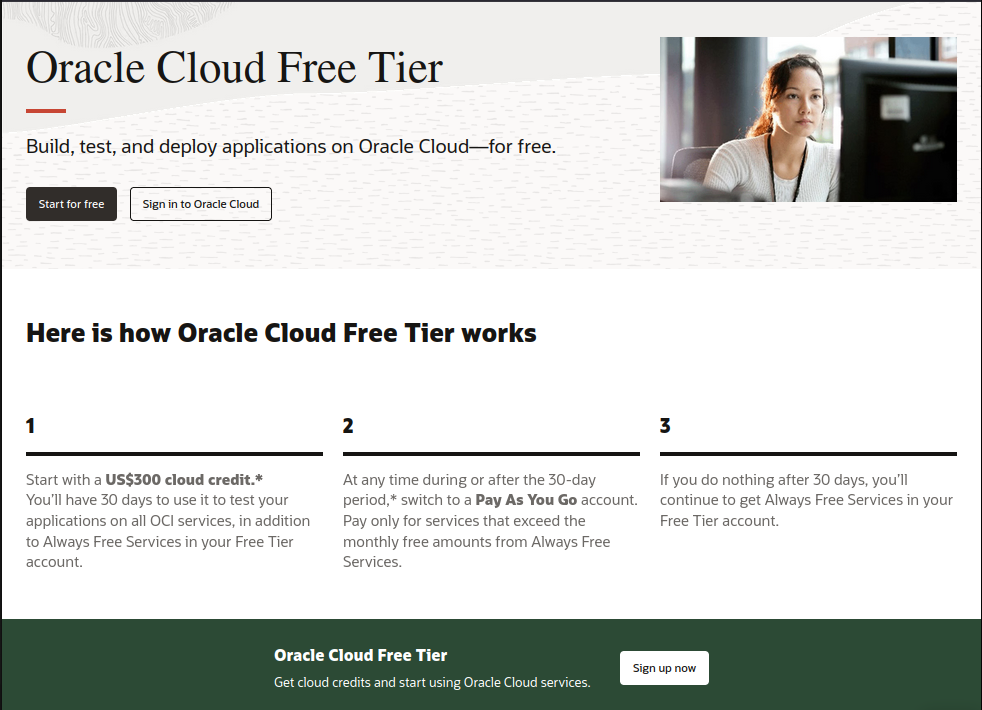  

</center>

- Created a Free Oracle Cloud account with it's requirements as documented [here](https://docs.oracle.com/en-us/iaas/Content/GSG/Tasks/signingup_topic-Sign_Up_for_Free_Oracle_Cloud_Promotion.htm).

- The following resources offered by Oracle Cloud free tier are a great fit for this project:
	- 2 CPU cores
	- 24 GB memory
	- 200 GB storage split into 2 blocks

	Referred to [their website](https://www.oracle.com/cloud/free/) for more details.

- Selected the preferred region from the Oracle Cloud web interface.

## Creating Nextcloud Instance
The sections below describe different stages of creating the Nextcloud instance in sequence as required.

### Create Compute Instance
- Followed the [steps to create an Ubuntu instance](https://docs.oracle.com/en-us/iaas/Content/Compute/Tasks/launchinginstance.htm) with the desired specifications, that fit within free tier.
- Established SSH connection with the instance using [these steps](https://docs.oracle.com/en-us/iaas/Content/Compute/Tasks/accessinginstance.htm).

### Preparing Ubuntu Server
#### Mounting Block Device
<center>

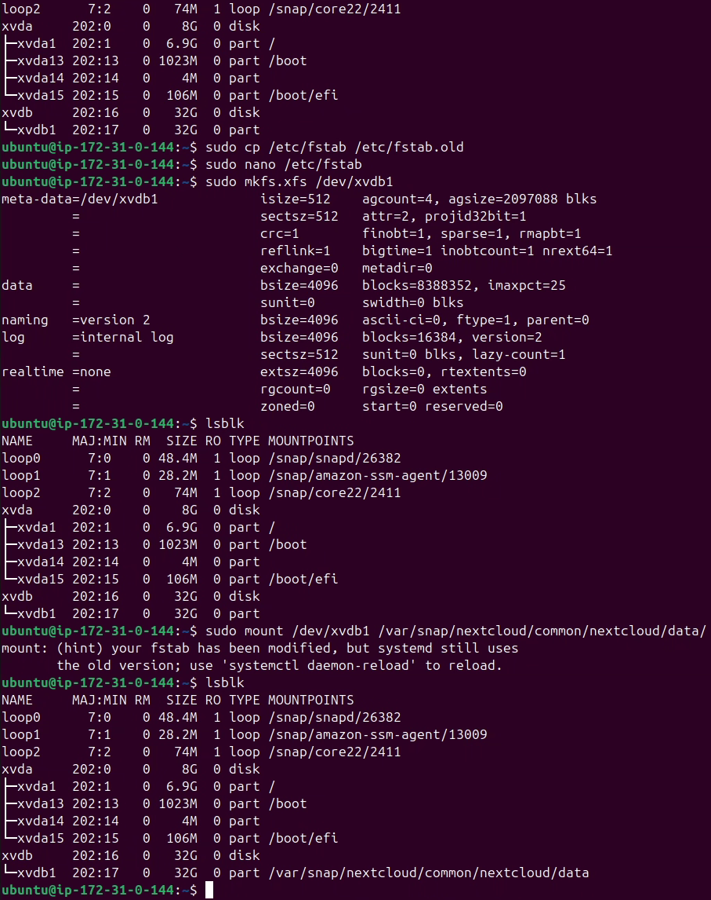  

</center>

- <ins>**Step 1:**</ins> Listed all available block devices
	```sh
	lsblk
	```

- <ins>**Step 2:**</ins> Formatted block device for usable storage space.
	```sh
	sudo fdisk /dev/<block-device-name>
	```
	Followed the `fdisk` help menu that's shown using option "`m`".

- <ins>**Step 3:**</ins> Created XFS file-system in the formatted device.
	- Noted the partiton name of the formatted block device
		```sh
		lsblk
		```
	- Created file-system using the partition name.
		```sh
		sudo mkfs.xfs /dev/<partition-name>
		```

- <ins>**Step 4:**</ins> Added mounting entry in the "_`/etc/fstab`_" file.
	```sh
	sudo cp /etc/fstab /etc/fstab.old
	echo -e "/dev/<partition-name>\t\t/var/snap/nextcloud/common/nextcloud/data/\t\tdefaults\t0 1" | sudo tee -a /etc/fstab
	```

- <ins>**Step 5:**</ins> Mounted the block device in the location where Nextcloud stores uploaded data.
	```sh
	sudo mkdir -p /var/snap/nextcloud/common/nextcloud/data
	sudo mount /dev/<partiton-name> /var/snap/nextcloud/common/nextcloud/data
	lsblk # see mount-points of all block devices
	```

#### Full System Update
- Update APT repository.
	```sh
	sudo apt update -y
	```
- Upgrade all system packages.
	```sh
	sudo apt dist-upgrade -y
	```
	Or,
	```sh
	sudo apt upgrade -y
	```

> [!NOTE]  
> Difference between _`upgrade`_ and _`dist-upgrade`_:
> - `upgrade` only upgrades the versions of installed packages but NEVER uninstalls or removes anything.  
> - `dist-upgrade` upgrades everything in the system, cleans up older versions and their dependencies, and upgrades the kernel versions.  
>   
> Basically, use `upgrade` for only upgrading the installed packages, use `dist-upgrade` to upgrade everything (including kernel) to newer versions and remove old ones.  

#### Hardening Security
- <ins>**Step 1:**</ins> Created a **non-root user** for administration with `sudo` privileges.
	- Created the user.
		```sh
		useradd <nextcloud-admin-username>
		```
	- Provided `sudo` privileges.
		```sh
		usermod -aG sudo <nextcloud-admin-username>
		```
- <ins>**Step 2:**</ins> Established a new SSH connection for the Nextcloud admin user.
	- Generated SSH key-pair in local machine.
		```sh
		ssh-keygen
		```
	- Followed steps to [create local connection to instance](https://docs.oracle.com/en-us/iaas/Content/Compute/References/serialconsole.htm#creating-instance-connection-local).
	- Login using the new SSH key
		```sh
		ssh -i /path/to/private-key-file <nextcloud-admin-username>@<instance-public-IP-addr>
		```
- <ins>**Step 3:**</ins> Tightened up SSH access
	- Opened the file "_`/etc/ssh/sshd_config`_" for editing with `sudo` privilege.
		```sh
		sudo nano /etc/ssh/sshd_config # use your preferred text editor
		```
	- Changed SSH port to custom port.
		```sh
		# Port 22 # leave original entry as comment
		Port <custom-port>
		```
	- Disabled root login.
		```sh
		# PermitRootLogin <old-value> # leave original entry as comment
		PermitRootLogin no
		```
	- Disabled password login
		```sh
		# PasswordAuthentication yes # leave original entry as comment
		PasswordAuthentication no
		```
	- Saved the edits made to the file `/etc/ssh/sshd_config`.
	- Restarted the SSH service daemon
		```sh
		sudo systemctl restart sshd.service
		```
	- _Without disconnecting current SSH connection_, tested the configuration chages through a new session
		```sh
		ssh -i /path/to/private-key-file <nextcloud-admin-username>@<instance-public-IP-addr> # should fail to connect
		ssh -i /path/to/private-key-file -p <custom-SSH-port> <instance-public-IP-addr> # should connect
		```

> [!WARNING]  
> 1. Custom SSH port _**must not** be `80` or `443`_ to avoid HTTPS certificate errors.
> 2. Incorrect SSH configuration can lead to <ins>**_permanent loss of access_**</ins> to the instance.  
>   
> In case of access loss to compute instance, either create new instance, or consult the Oracle Cloud support and forums for workarounds.  

- <ins>**Step 4:**</ins> Limiting network access
	- Checked port usage by different processes
		```sh
		netstat -plunt
		ss -plunt # if netstat isn't installed
		```
	- Investigated the output from `netstat` or `ss` and uninstall/stop the unwanted/unnecessary processes.
	- Installed Uncomplicated Firewall (UFW)
		```sh
		sudo apt install -y ufw
		```
	- Allowed ports for SSH, HTTP and HTTPS
		```sh
		sudo ufw allow <custom-ssh-port>
		sudo ufw allow 80,443/tcp
		```
	- Disabled `ping` response
		- Added the entry below to the file "_`/etc/ufw/before.rules`_" with your preferred text editor.
			```sh
			-A ufw-before-input -p icmp --icmp-type echo-request -j DROP
			```
		- Added the entry below to the file "_`/etc/ufw/before6.rules`_" with your preferred text editor.
			```sh
			-A ufw6-before-input -p icmpv6 --icmpv6-type echo-request -j DROP
			```
		<center>

		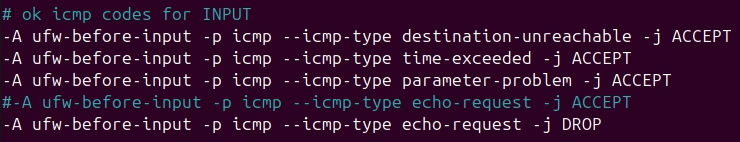  

		</center>
		
		<center>

		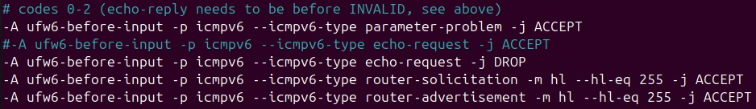  

		</center>
		
	- Enabled and verified UFW configuration
		```sh
		sudo ufw enable
		sudo ufw status
		```

	<center>

	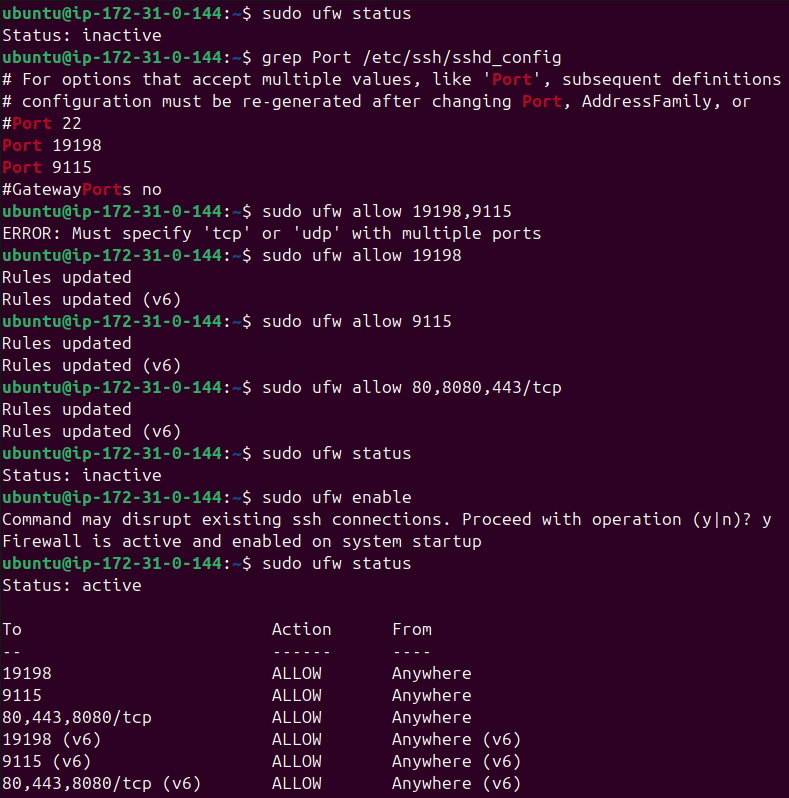  

	</center>

- [_Optional_] <ins>**Step 5:**</ins> Enable automatic updates for stable packages
	- Installed Unattanded Upgrades pacakge
		```sh
		sudo apt install -y unattended-upgrades
		```
	- Enabled the automatic upgrades
		```sh
		sudo dpkg-reconfigure --priority=low unattended-upgrades
		```
	- Select "`Yes`" when prompted.
	<center>

	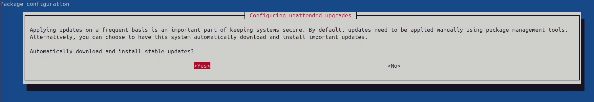

	</center>

## Configuring Nextcloud
The Snap package of Nextcloud takes care of a lot of configuration automatically to make it as easy as possible to install and run it. However, certain settings can, or are required to, be configured manually.

### Initial Login
<center>

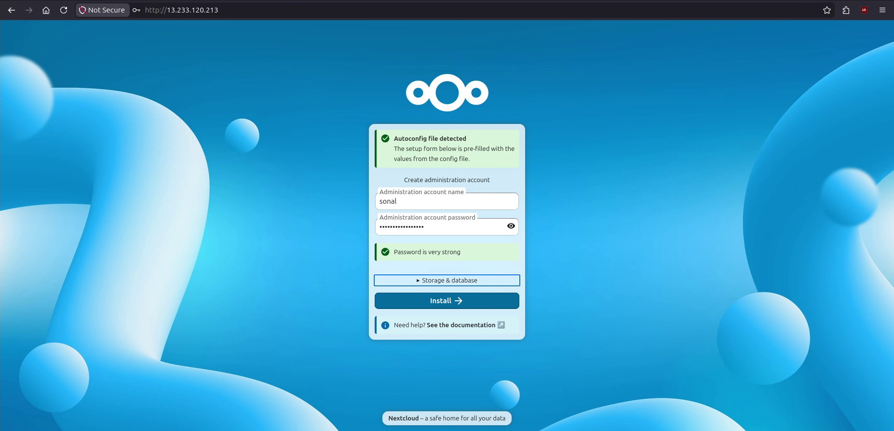  

</center>

<details>
<summary>Extra configuration options</summary>

<center>

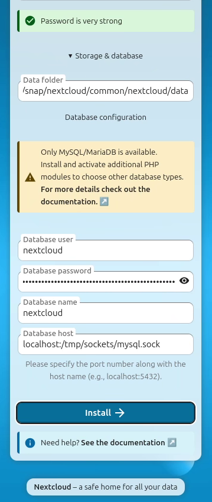  

</center>

</details>

- Opened the Nextcloud web interface by going to "**`http://<instance-public-IP-addr>`**".
- Entered the following details as prompted in the webpage:
	- [**Reuqired**] Nextcloud Admin credentials (username and password).
	- [_Optional, automatically set_] Path to store data uploaded by users.
	- [_Optional, automatically set_] Database Admin credentials (username and password).
- Clicked on _Install_ button to start the configuration.
- Chose the preferred apps from the _Recommended apps_ menu and clicked on Install recommended apps button. Password was required to verify.
	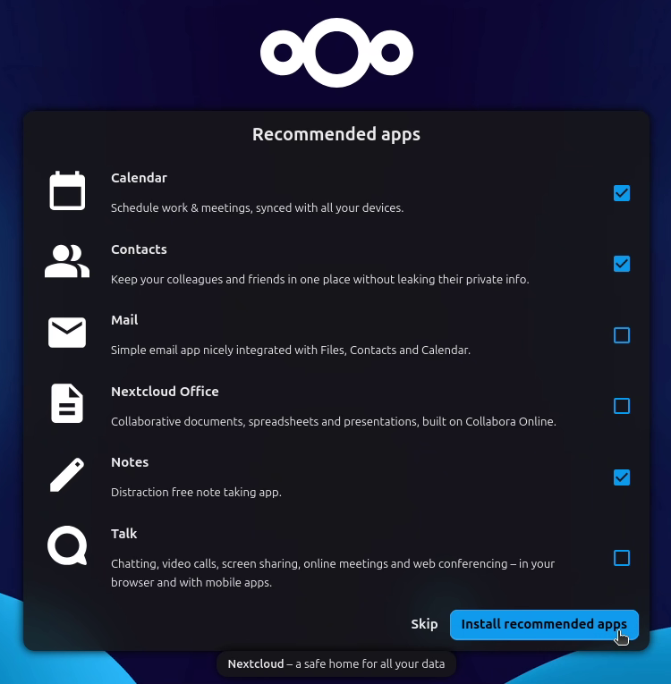  

Nextcloud home page is opened when the configuration and app installation is finished successfully.

### Linking Domain Name
- <ins>**Step 1:**</ins> Acquired a domain name
	- Logged in to [Duck DNS](https://duckdns.org).
	- Created a domain name, taking "_hijinx.duckdns.org_" as example here.
	- Pointed domain name to the Nextlcoud instance's public IP address.
	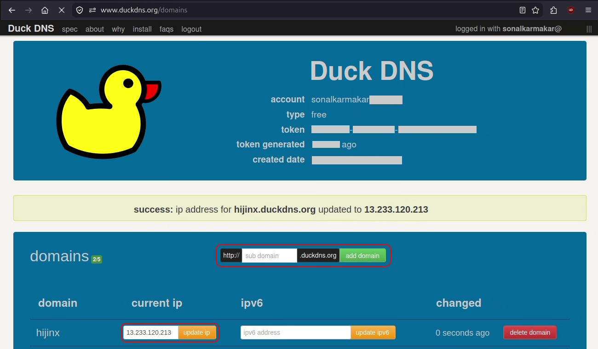

- <ins>**Step 2:**</ins> Whitelist domain name for accessing Nextcloud.
	- Ran the whitelisting command below.
		```sh
		sudo nextcloud.occ config:system:set trusted_domains <index-number> --value=hijinx.duckdns.org # index-number must be greater than 0
		```
	- Verified that the domain name is added.
		```sh
		sudo cat /var/snap/nextcloud/current/nextcloud/config/config.php
		```

> [!IMPORTANT]  
> - The "`<index-number>`" in the whitelisting command can be anything over 0. Any _existing entries will be overwritten_ for the specified index.
> - Whitelisting can be also done by adding the domain name in the file "_`/var/snap/nextcloud/current/nextcloud/config/config.php`_".
> 	```php
> 	'trusted_domains' => 
> 	array (
> 		0 => '13.212.154.88',
> 		1 => 'hijinx.duckdns.org',
> 	),
> 	```

- <ins>**Step 3:**</ins> Verified that Nextcloud is accessible using the doman name at "`http://hijinx.duckdns.org`".

#### Automatic IP address update
Usually, upon rebooting the instance, the public IP address remains unchanged. However, a shut down will cause the instance to be assigned a new IP address when booted up.  

Duck DNS provides numerous methods of automatically updating the IP address for the domain name. Using cron job triggered by reboot to update IP address here.  

- <ins>**Step 1:**</ins> Logged in to [Duck DNS](https://duckdns.org) website.
- <ins>**Step 2:**</ins> Opened the [Duck DNS "linux-cron" page](https://www.duckdns.org/install.jsp?tab=linux-cron) and selected domain name.
- <ins>**Step 3:**</ins> Followed the instruction to create cron job in the page, but used the following cron entry.
	```sh
	@reboot ~/duckdns/duck.sh >/dev/null 2>&1
	```
- <ins>**Step 4:**</ins> Verified Duck DNS IP address update by running the script manually.
	```sh
	bash ~/duckdns/duck.sh
	```

### Let's Encrypt HTTPS Certification
> [!IMPORTANT]  
> - **Domain name is mandatory** for HTTPS certification.  
> - It's possible to get certificate witout `sudo` privileges, but it's inconsistent and can face random issues.  

<center>

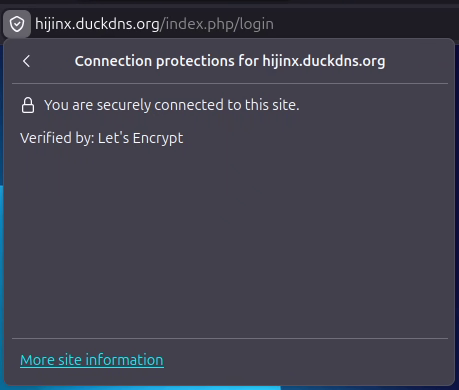  

</center>

- <ins>**Step 1:**</ins> Switch to root user to avoid permission issues.
	```sh
	sudo -i
	```
- <ins>**Step 2:**</ins> Run the command to enable Nextcloud HTTPS certification.
	```sh
	sudo nextcloud.enable-https lets-encrypt
	```
- <ins>**Step 3:**</ins> Enter the **correct** _email address_ and _domain name_ when prompted.
- <ins>**Step 4:**</ins> Wait for execution completion. Successful execution will get the certification and restart Apache.
	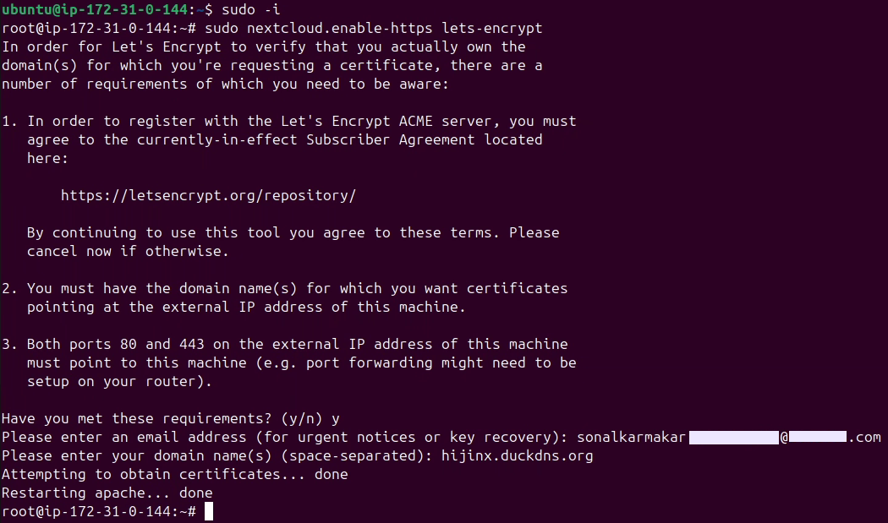  

## Screenshots
- <details>
	<summary>🔐 Personalised Login Page</summary>

	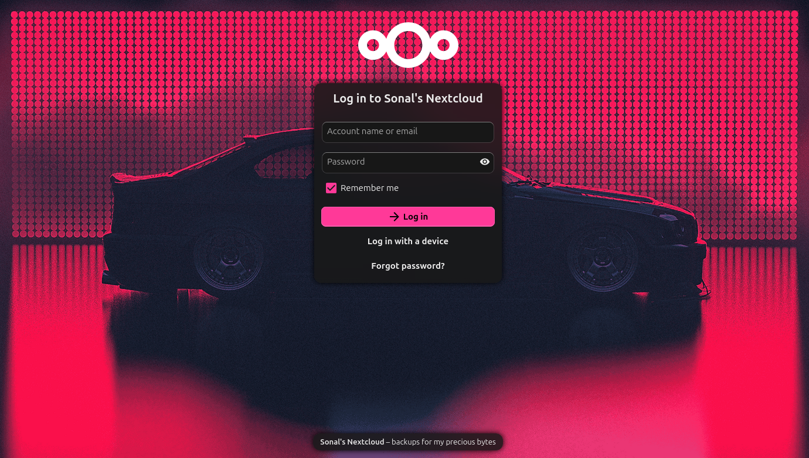
	
  </details>

- <details>
	<summary>🎛️ Customised Dashboard</summary>

	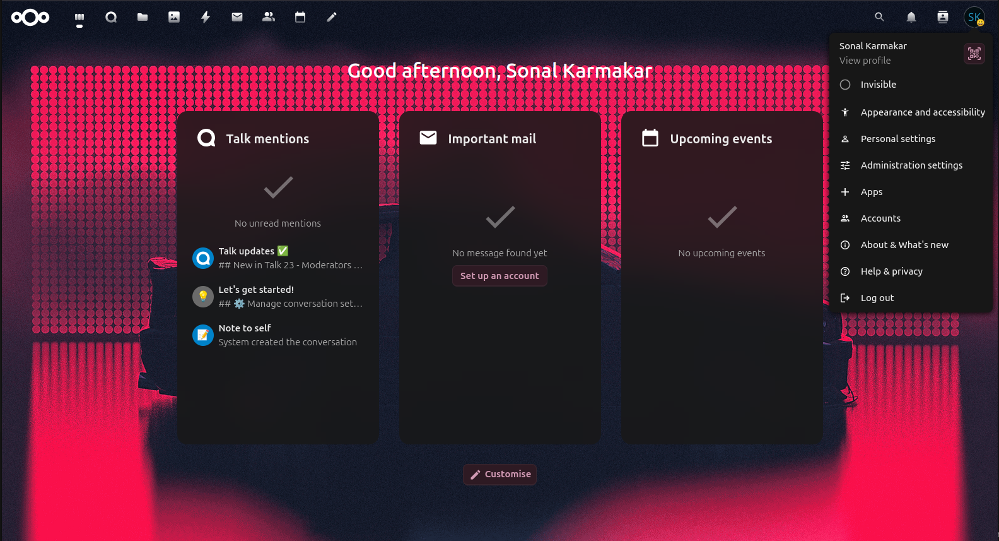
	
  </details>

- <details>
	<summary>🗄️ File Storage</summary>

	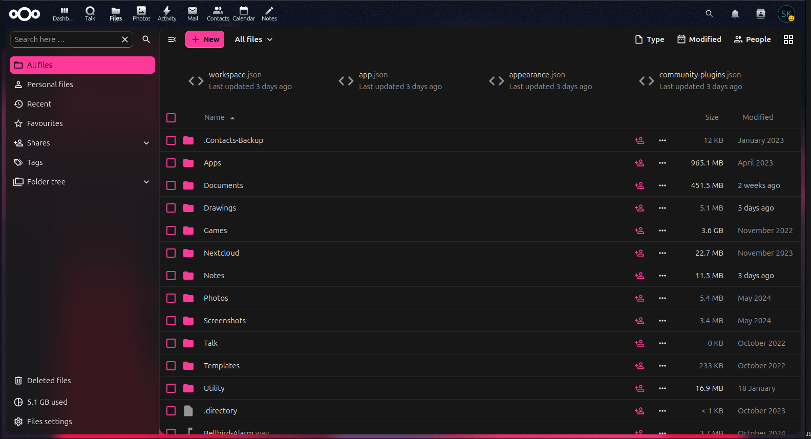
	
  </details>

- <details>
	<summary>⚙️ Settings Menu</summary>

	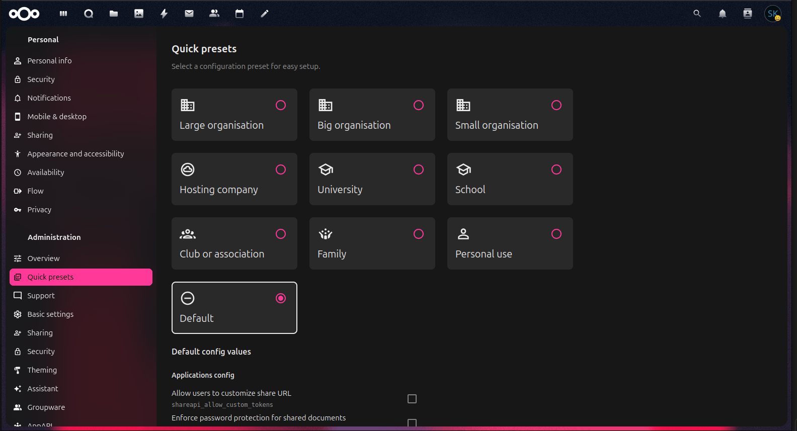
	
  </details>

## References
- [Full documentation of using Nextcloud Snap](https://github.com/nextcloud-snap/nextcloud-snap/wiki/).
- [Video guide of simple Nextcloud Snap installation](https://youtu.be/rUQAWvXrtPY).
- [Video guide of Linux server hardening](https://youtu.be/ZhMw53Ud2tY).
- [Oracle Cloud documentation](https://docs.oracle.com/en-us/iaas/Content/).